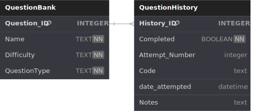

When working functionality is reached > 
    + implemnent relational tables with SQL lite
    + Scheduling
    + Typescript practice + basic frontend

- planned features
    + History

Reminders Discord bot? (unless TS has easier alternative)

Show:
completed
Upcoming

filter by:
- Completed / Not Competed
- Date Completed
- Date Attempted
- Number of Attempts
- Question Type

FUTURE PLANS:
- Add tables (mySQL?) instead of using dictionaries. (good practice for fall class)
- Convert to typescript (good practice) and implement with tsamantanis/leetcode-api
- Fronted? (svelete?) [lowest-priority]

___

Database setup

