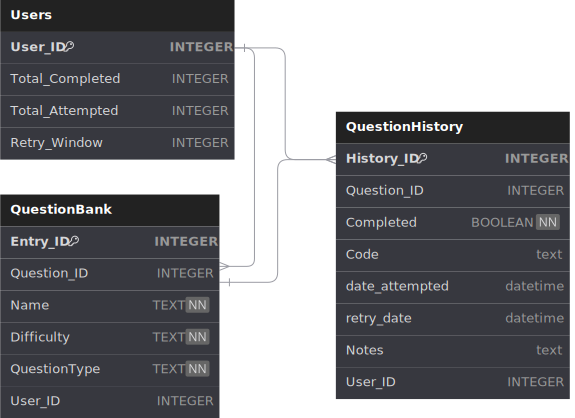

## LCM Project
**Main Purpose:** Practice and learn relational databases for upcoming database class in the Fall\
Discord bot that logs and send reminders of submitted LeetCode Questions & their progression history\
Implemented in python with discord.py, aiosqlite, and (eventually) JS/REACT/DJANGO\

## Dev Notes:
Discord Branch -> WIP implementing Discord Functionality
Main Branch -> Original version using OOP and CLI

Small scale bot as it uses sqlite. Program can be expanded on for mass use with ... (MongoDB, mySQL??)

- TODO:
    - [x] implemnent relational tables with SQL lite
    - [x] implemnent async functionality with aiosqlite
    - [x] Add user (doesn't need additional input)
    - [x] CheckExisting
    - [x] Reference User RetryWindow Column
    - [x] Incorpodrate NOTES and CODE strings in add submission

    - [] **BUG: getters not getting user-specific rows**

    - [>] neaten up and incorporate CheckFormatting() functions
        -> stil gotta clean em
    - [>] Connect to Discord.py Commands
        - [x] Update Retry Window Column (updateRetryDate())
        - [>] Add Submission functions
            - [>] reference timedelta from Users Column
        - [>] List Question Types
            -> Stil gotta add all quesiton types
        - ***[>] Show Tables Commands / Display Questions
            -[x] Format by QID / Completed / Upcoming / TODO today
                -> ~~?getupcoming~~, ~~?todo~~, ,~~?completed~~ , ~~?show <QID>~~
        - [x] reformat ?listTypes
        - [x] update question
        - [] delete question
        - [] Update NOTES AND CODE Columns in User function
    - [>] Scheduling System
        - [] apply fix for when User doesn't complete all todos due that day 
            -> Add to next day
            -> Notify again Nearing end of day ( 8pm? )

    - [>] Update Help Menu
    - [] Check if Question attributes are all added to tables as .upper
    - [] make ?addSubmission to take a paramater of QID?
    - [] Notification System
    - [] Organize: Sperate functions into different files 
        - AIODB, BOT, HELPER, CONST, MSC
    - [] Testing
    - [] Extra Features?
        - [] DM'S only implementation???
        - [] Character Limitation for NOTES AND CODE
        - [] implement basic frontend (Typescript practice)
        - [] Implement ON_COMMAND_ERROR
        - [] link QID to leetcode API for consistent question entries
    - [] -> extra row in history table that increments for each user. Currently it increments no matter what user. see ?history
    - [] -> NOTES AND CODE. Better formatting? Syntax highlighting. Python lsp throws lil buggy buy error

- planned features
    - [>] History Logging
    - [] Reminders & interaction via Discord bot
    - [] Basic Front-end
        - gotta figure out how to link everything togetha first

- Misc Ideas and Features
    Show by:
    - completed
    - Upcoming -- Done

    filter by:
    - Completed / Not Competed
    - Date Completed
    - Date Attempted
    - Number of Attempts
    - Question Type

FUTURE PLANS:
- [x] Add tables (mySQL?) instead of using dictionaries. (good practice for fall class)
- [] Convert to typescript (good practice) and implement with tsamantanis/leetcode-api
- [] Fronted? (svelete?) [lowest-priority]

## Project Setup
- / /assets      -> .svg pictures depictiing DB Table Relationships
- / /LCM         -> python3 venv (Ignored in .gitignore)
- / /.gitignore  -> ignoring shi
- / /aioDB.py    -> Asyncronous implementation of (depreciated) 'database.py'
- / /bot.py      -> Discord bot implemenation (Commands, I/O, Help Menu, Connections)
- / /config.py   -> tokens (hidden in .gitignore)
- / /database.py -> Old implementation of CLI LCM
- / /README.md   -> this file
- /󰈙 /requirements.txt -> run `pip install -r requirements.txt` to install venv packages
- / /schema.py   -> Const for 'aioDB' separated for readibility

___

---
## Obsidian notes:
WIP

---
## Project Reflection:
WIP
